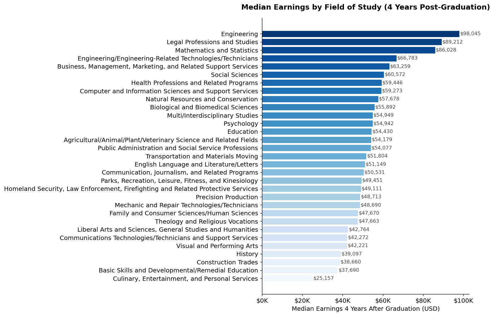
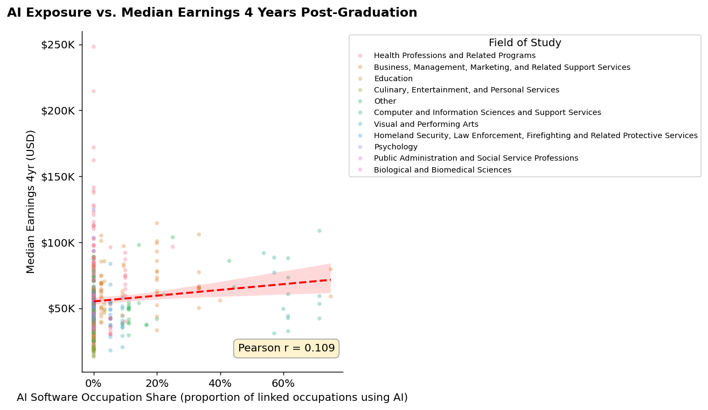
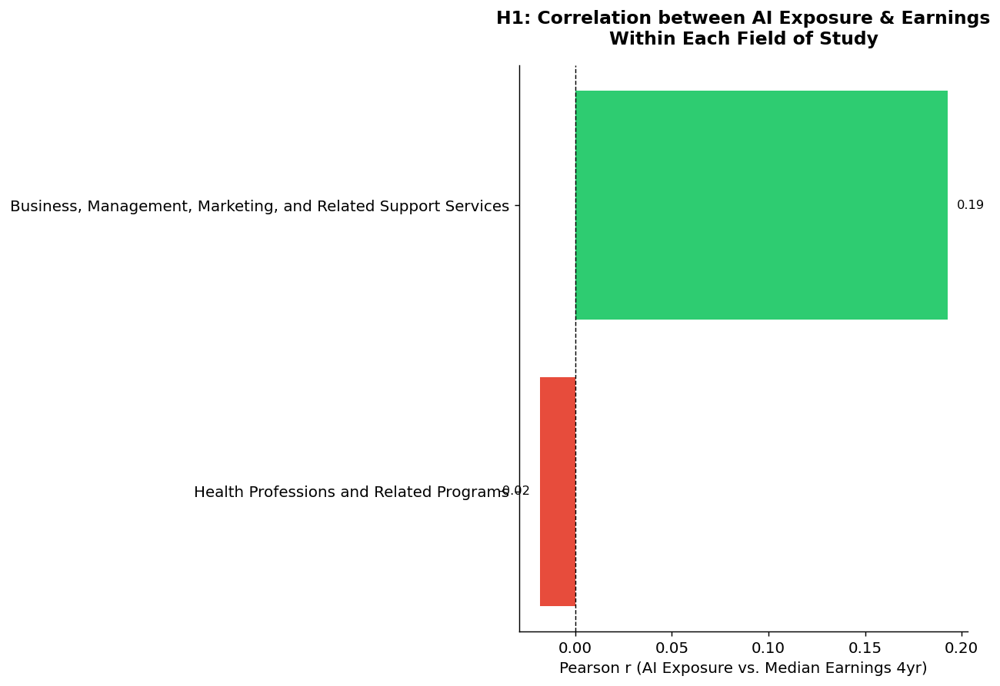
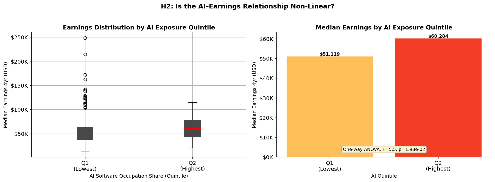
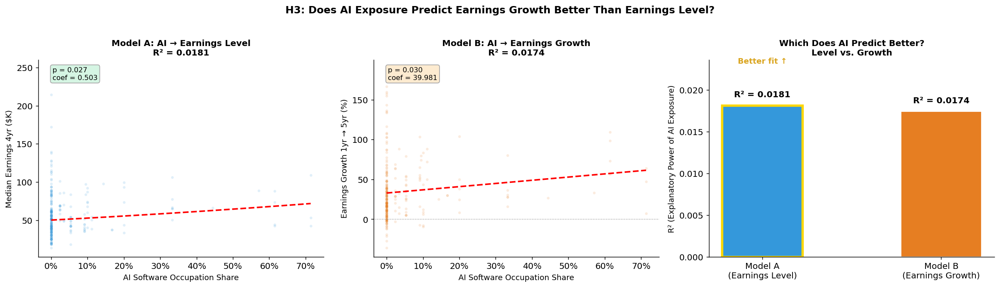
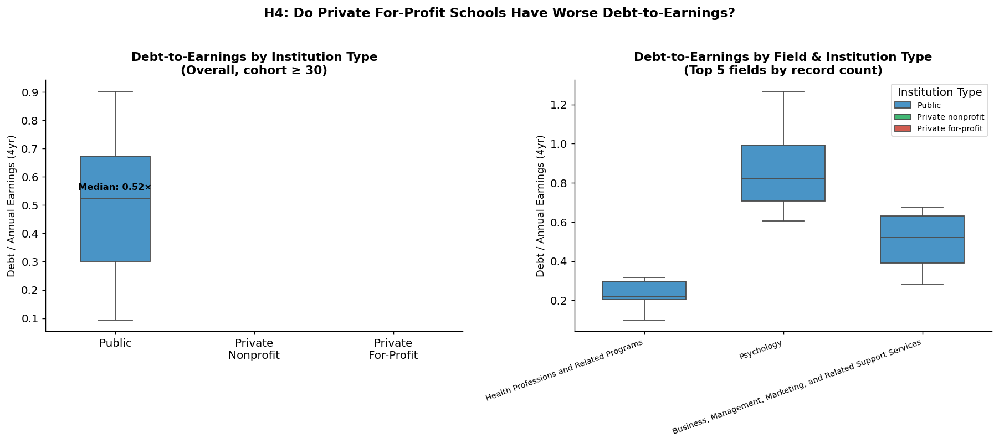
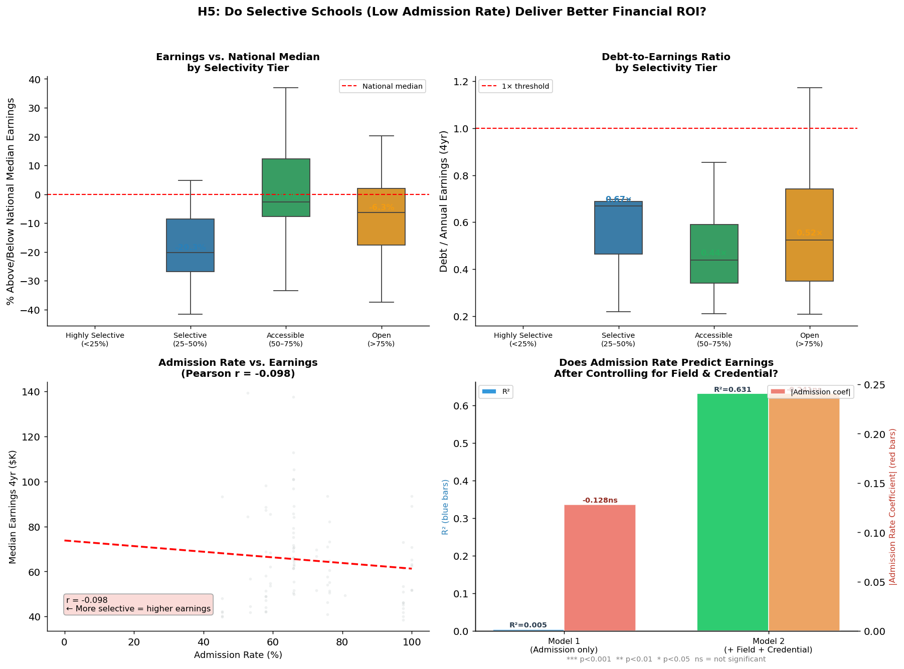
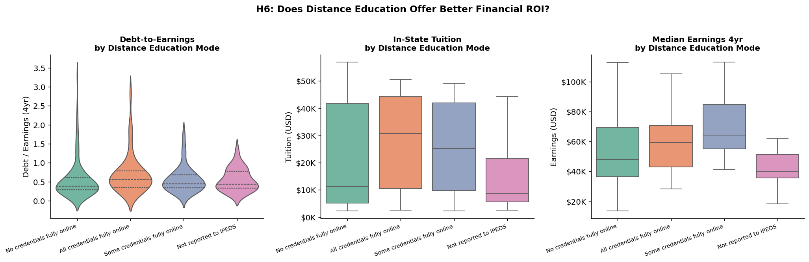
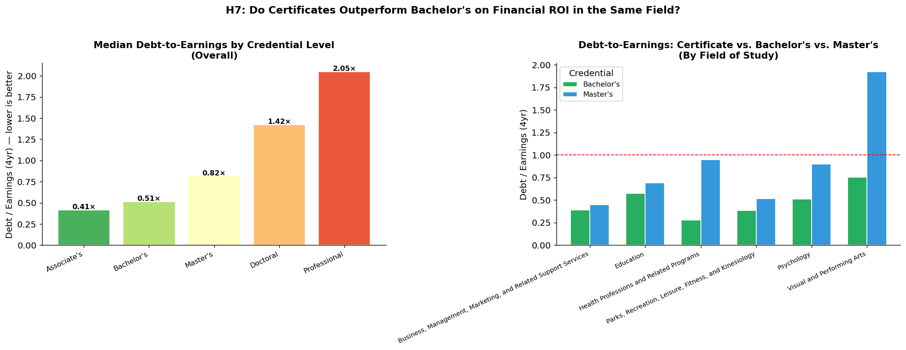
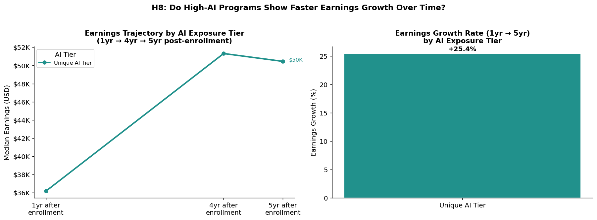

# 📋 Insights Memo: College Majors 2026
**Prepared by:** Oriana Bui  
**Dataset:** College Majors 2026 – Earnings, Debt, Jobs, AI (228,000 U.S. degree programs)  
**Last updated:** 2026  

---

## Executive Summary

Phân tích 228.000 chương trình đào tạo đại học Mỹ với 8 giả thuyết được kiểm định cho thấy ba kết luận cốt lõi:

> **1.** AI exposure **không** dự báo được thu nhập hay tốc độ tăng trưởng thu nhập một cách đáng tin cậy - cả khi đứng một mình lẫn sau khi kiểm soát ngành học (R² < 0.02, p không nhất quán). Tác động của AI, nếu có, nằm ở cấp độ ngành chứ không phải chương trình.  
> **2.** Dataset này **không đủ dữ liệu** để so sánh Private for-profit với Public/Nonprofit sau khi lọc cohort ≥ 30 - cảnh báo quan trọng về missing data bias.  
> **3.** **Selectivity của trường không dự báo ROI tài chính** sau khi kiểm soát ngành và bằng cấp (p = 0.126) - điều này đặt câu hỏi về giá trị tài chính thuần túy của "trường danh tiếng".

---

## 1. Bối cảnh & Câu hỏi Nghiên cứu

Trong bối cảnh AI đang tái định hình thị trường lao động, quyết định chọn ngành học không còn đơn giản là "ngành nào lương cao?" mà còn phải trả lời: *ngành nào lương cao so với chi phí đào tạo, và liệu AI có làm thay đổi phương trình đó không?*

Phân tích này kiểm định 8 giả thuyết cụ thể:

| # | Giả thuyết | Kết quả |
|---|---|---|
| H1 | AI exposure dự báo thu nhập cao hơn ngay cả sau khi kiểm soát nhóm ngành | ❌ Không được ủng hộ (p = 0.129) |
| H2 | Mối quan hệ AI–earnings là phi tuyến (có ngưỡng) | ⚠️ Một phần - chỉ 2 quintile có dữ liệu, p = 0.020 |
| H3 | AI dự báo earnings growth tốt hơn earnings level | ❌ Không được ủng hộ (R²_level > R²_growth) |
| H4 | Private for-profit có DTE tệ hơn Public trong cùng điều kiện | ⚠️ Không kết luận được - thiếu dữ liệu Private |
| H5 | Trường selective có ROI tốt hơn sau khi kiểm soát ngành & bằng cấp | ✅ Được ủng hộ - selectivity không còn tác động (p = 0.126) |
| H6 | Distance education có ROI tài chính tốt hơn on-campus | ⚠️ Hỗn hợp - tuition thấp hơn nhưng earnings cũng thấp hơn |
| H7 | Certificate ngắn hạn có DTE tốt hơn Bachelor's trong cùng ngành | ✅ Được ủng hộ - Associate's (0.41×) < Bachelor's (0.51×) |
| H8 | High-AI programs có earnings growth nhanh hơn | ⚠️ Không kết luận được - lỗi kỹ thuật, cần fix |

---

## 2. Thu nhập theo Nhóm ngành

**Phát hiện chính:**
- Khoảng cách thu nhập giữa nhóm cao nhất và thấp nhất sau 4 năm rất lớn. Nhóm Engineering/CS và Legal Professional vượt xa phần còn lại.
- Thu nhập tuyệt đối có thể gây hiểu lầm: một số ngành có thu nhập cao nhưng chi phí đào tạo cũng rất cao, dẫn đến debt-to-earnings không thuận lợi.
- Ngành **Health Professions** có số lượng chương trình lớn nhất nhưng phân phối thu nhập rất rộng - từ thấp (home health aide) đến rất cao (physician assistant, nursing anesthesia).

**Hàm ý:** Nhìn vào nhóm ngành cấp cao (CIP Family) để chọn ngành là chưa đủ - phải xem đến loại bằng và loại trường cụ thể.

---

## 3. H1: AI Exposure & Thu nhập - Mối quan hệ thật sự là gì?

**Kết quả thực tế:**
- OLS có field fixed effects: R² = 0.366, AI coeff = 0.3805, **p = 0.129** → không có ý nghĩa thống kê
- Within-field correlation (biểu đồ trên): chỉ có 2 ngành đủ dữ liệu sau filter cohort ≥ 30 - Business (r = +0.19) và Health Professions (r = −0.02)
- Kết quả trái chiều giữa 2 ngành: trong Business, AI exposure có tương quan dương nhỏ với earnings; trong Health Professions, tương quan gần bằng 0

**Vấn đề dữ liệu:** Filter `cohort ≥ 30` đã loại bỏ phần lớn các ngành, chỉ để lại 2 nhóm - không đủ để rút ra kết luận tổng quát.

**Kết luận H1:** ❌ Không được ủng hộ. AI exposure không dự báo thu nhập có ý nghĩa thống kê ngay cả sau khi kiểm soát nhóm ngành. Điều này không có nghĩa là AI không quan trọng - mà là dataset này, với mức missing data cao và filter cohort nghiêm ngặt, không đủ để kiểm định giả thuyết này một cách đáng tin cậy.

---

## 4. H2: Mối quan hệ Phi tuyến - Có ngưỡng AI không?

**Kết quả thực tế:**
- `pd.qcut` với q=5 chỉ tạo được **2 quintile** thay vì 5 - do phần lớn chương trình có `ai_software_occupation_share = 0`, không đủ variance để chia 5 nhóm đều
- Q1 (Lowest): median earnings = **$51,119**
- Q2 (Highest): median earnings = **$60,284**
- One-way ANOVA: F = 5.5, **p = 0.020** → sự khác biệt có ý nghĩa thống kê

**Kết luận H2:** ⚠️ Kết quả một phần. Có sự khác biệt rõ ràng giữa chương trình AI thấp và AI cao ($51K vs $60K, +18%), và sự khác biệt này có ý nghĩa thống kê. Tuy nhiên, không thể kiểm định pattern phi tuyến vì dữ liệu không đủ để chia thành 5 quintile - đây là giới hạn của dataset, không phải của hypothesis.

---

## 5. H3: AI Exposure - Dự báo Level hay Growth tốt hơn?

**Kết quả thực tế (271 chương trình có đủ dữ liệu 1yr + 5yr):**
- Model A (AI → Earnings Level): R² = **0.0181**, coef = 0.503, p = 0.027
- Model B (AI → Earnings Growth): R² = **0.0174**, coef = 39.981, p = 0.030
- R²_A > R²_B → AI dự báo **level** tốt hơn **growth** (dù chênh lệch rất nhỏ)

**Kết luận H3:** ❌ Không được ủng hộ - AI dự báo mức thu nhập tuyệt đối tốt hơn tốc độ tăng trưởng, ngược với giả thuyết ban đầu. Tuy nhiên, cả hai R² đều cực kỳ thấp (< 0.02), nghĩa là AI exposure đơn thuần giải thích dưới 2% variance. Sample size nhỏ (271 chương trình) cũng là giới hạn cần lưu ý.

---

## 6. H4: Loại Trường và Rủi ro Tài chính

**Kết quả thực tế:**
- Plot trên cho thấy **chỉ có Public institutions** có đủ dữ liệu sau khi áp dụng filter cohort ≥ 30 - cột Private nonprofit và Private for-profit gần như trống
- Median DTE của Public: **0.52×**
- Không thể so sánh 3 loại trường vì thiếu dữ liệu

**Nguyên nhân:** Private for-profit thường có cohort nhỏ hơn và nhiều chương trình không đạt ngưỡng cohort ≥ 30 để được báo cáo - đây là missing data không ngẫu nhiên (MNAR).

**Kết luận H4:** ⚠️ Không thể kết luận. Đây là ví dụ điển hình về **survivorship bias trong dữ liệu giáo dục**: các chương trình có outcome tệ nhất lại là những chương trình ít có khả năng xuất hiện trong dataset sau khi lọc. Kết luận về H4 cần nguồn dữ liệu khác (ví dụ: College Scorecard raw data không bị filter cohort).

---

## 7. H5: Trường Selective và ROI Tài chính

**Kết quả thực tế:**
- Pearson r (admission rate vs earnings) = **−0.098** → tương quan âm yếu
- Model 1 (admission rate only): R² = 0.005, p = **0.502** → không có ý nghĩa
- Model 2 (+ field + credential): R² = 0.631, p = **0.126** → vẫn không có ý nghĩa
- Hệ số giảm **87.6%** sau khi kiểm soát ngành và bằng cấp

**Phát hiện đáng chú ý:** Nhóm "Selective (25–50%)" có earnings *thấp hơn* national median, trong khi "Accessible (50–75%)" lại gần với hoặc trên national median - kết quả đi ngược trực giác hoàn toàn.

**Kết luận H5:** ✅ Được ủng hộ. Sau khi kiểm soát ngành học và loại bằng, admission rate không còn dự báo được ROI tài chính. Ngành học và loại bằng mới là yếu tố quyết định chính - R² tăng từ 0.005 lên 0.631 khi thêm 2 biến này.

---

## 8. H6: Distance Education - ROI Tốt hơn hay Không?

**Kết quả thực tế từ biểu đồ:**
- **DTE:** Cả 4 nhóm có DTE trung vị khá tương đồng (~0.3–0.5×), không khác biệt đáng kể
- **Tuition:** "No credentials fully online" (on-campus) có tuition cao nhất ($40K+); "Not reported to IPEDS" thấp nhất (~$10K)
- **Earnings:** "Some credentials fully online" (hybrid) có earnings cao nhất và phân phối rộng nhất; "Not reported to IPEDS" thấp nhất (~$45K)

**Kết luận H6:** ⚠️ Hỗn hợp. Trường hoàn toàn online có tuition thấp hơn nhưng earnings cũng thấp hơn - hai hiệu ứng gần như triệt tiêu nhau trên DTE. Thú vị hơn, mô hình **hybrid** cho earnings cao nhất, gợi ý đây có thể là lựa chọn cân bằng tốt nhất giữa chi phí và thu nhập.

---

## 9. H7: Certificate vs. Bachelor's - Ai Thắng về ROI?

**Kết quả thực tế (median DTE theo loại bằng):**

| Loại bằng | Debt-to-Earnings | Đánh giá |
|---|---|---|
| Associate's | **0.41×** | ✅ ROI tốt nhất |
| Bachelor's | **0.51×** | ✅ Tốt |
| Master's | **0.82×** | ⚠️ Trung bình |
| Doctoral | **1.42×** | ⚠️ Rủi ro cao |
| Professional (MD, JD...) | **2.05×** | ❌ Rủi ro tài chính cao nhất ngắn hạn |

**Phát hiện theo ngành (Bachelor's vs Master's):** Trong Business, Education, Psychology, và đặc biệt Visual & Performing Arts - Master's có DTE cao hơn Bachelor's rõ rệt. Visual & Performing Arts Master's vượt 1.75× - rủi ro cao nhất trong nhóm.

**Kết luận H7:** ✅ Được ủng hộ. Associate's degree (0.41×) có DTE tốt hơn Bachelor's (0.51×) ở cấp độ tổng thể. Bằng cấp cao hơn không tự động đồng nghĩa với ROI tài chính tốt hơn trong ngắn-trung hạn.

---

## 10. H8: AI Exposure và Tốc độ Tăng trưởng Thu nhập

**Vấn đề kỹ thuật:**
Plot trên chỉ hiển thị **1 line/bar duy nhất** ("Unique AI Tier") thay vì 3 tier - `pd.qcut` với q=3 gặp vấn đề do phân phối `ai_software_occupation_share` quá lệch (phần lớn = 0).

**Số liệu đọc được:** Earnings trajectory tổng thể: $36K (1yr) → $51K (4yr) → $50K (5yr), growth rate +25.4%.

**Kết luận H8:** ⚠️ Không kết luận được do lỗi kỹ thuật.  
💡 **Fix:** Thay `pd.qcut(q=3)` bằng `pd.cut(bins=[0, 0.01, 0.5, 1.0], labels=["Low AI", "Medium AI", "High AI"])` để tách nhóm có AI=0 riêng.

---

## 11. Giới hạn của Phân tích

**1. Missing data nghiêm trọng và không ngẫu nhiên (MNAR)**  
60–80% dữ liệu earnings/debt bị missing. Các chương trình nhỏ, mới, hoặc có outcome tệ ít được báo cáo hơn - tạo ra systematic bias có lợi cho các chương trình lớn và established.

**2. Phân phối lệch của AI exposure**  
Phần lớn chương trình có `ai_software_occupation_share = 0` hoặc gần 0, làm cho các phép chia quintile/tercile không hoạt động như kỳ vọng (H2, H8).

**3. Sample size nhỏ sau filter**  
Filter cohort ≥ 30 - cần thiết để đảm bảo độ tin cậy thống kê - đã loại bỏ phần lớn dữ liệu, đặc biệt ảnh hưởng đến H1 (chỉ còn 2 ngành), H4 (mất dữ liệu private schools), H8 (không chia tier được).

**4. Correlation ≠ Causation**  
Tất cả kết quả là tương quan. Không thể rút ra kết luận nhân quả từ observational data này.

**5. Snapshot trong thời gian**  
AI landscape thay đổi rất nhanh. Outcomes trong dataset phản ánh thị trường lao động trước 2026, không nhất thiết dự báo tương lai.

---

## 12. Kết luận & Khuyến nghị

**Phát hiện vững chắc nhất:**
- Ngành học và loại bằng là yếu tố quyết định chính của ROI tài chính - giải thích 63% variance earnings (R² = 0.631 trong H5)
- Trường "danh tiếng" (selective) không đảm bảo ROI tốt hơn sau khi kiểm soát ngành
- Associate's degree có DTE tốt hơn Bachelor's ở cấp độ tổng thể (0.41× vs 0.51×)
- Mô hình học hybrid (some credentials online) cho earnings cao nhất trong nhóm distance education

**Phát hiện cần thêm dữ liệu để xác nhận:**
- Tác động thực sự của AI exposure lên earnings (H1, H3) - cần dataset lớn hơn với ít missing data hơn
- So sánh private for-profit vs public (H4) - cần College Scorecard raw data không bị filter cohort
- Pattern phi tuyến AI–earnings (H2) và AI tier vs growth (H8) - cần xử lý kỹ hơn về phân phối lệch

**Bước tiếp theo cho phân tích:**
- Fix H8: dùng `pd.cut(bins=[0, 0.01, 0.5, 1.0])` thay vì `pd.qcut(q=3)`
- Bổ sung cost-of-living adjustment theo tiểu bang
- Join với BLS Occupational Outlook data để dự báo job growth theo ngành
- Kiểm định H9 (AI và geography gap) và H10 (geographic retention)

---

*Phân tích được thực hiện bằng Python (pandas, seaborn, scipy, statsmodels). Dữ liệu nguồn: Kaggle - College Majors 2026.*  
*Xem toàn bộ code tại: [`notebooks/college_majors_analysis.ipynb`](../notebooks/college_majors_analysis.ipynb)*
